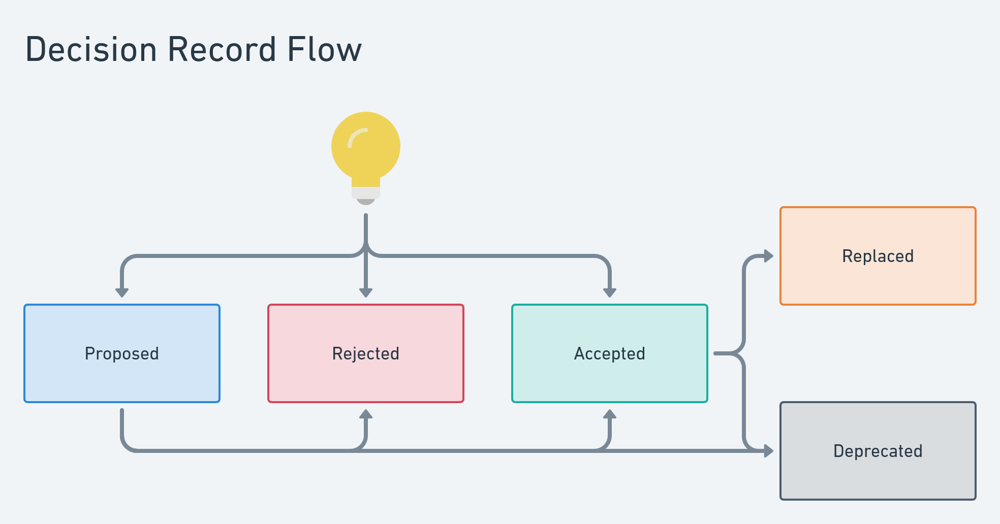

# Decision record

## 🏗️ ADR0001: Use Decision Records

<!--
  Prerequisites, context and initial info
  in order to understand what this ADR is about.
  What is the issue that is motivating this decision or change?
-->

Some times it is hard to remember why or how certain thing were implemented.
Why certain library or architecture was choosen.

---

## 🤝 Decision

<!--
  What was decided?
  What is the proposed change or what should be done?
-->

Create Decision Record for every meaningful change in development process.

- Library
- Framework
- Practice
- etc.

Using following statuses:

- Proposed
- Accepted
- Rejected
- Replaced
- Deprecated

---

## ⚖️ Rationale

<!--
  Why it was decided so?
  Which alternatives where considered?
-->

Decision records allow to trace back changes in development.
Give historical reference.
Provide insites for onboarding.

---

## ✨ Consequences

<!--
  What positive and/or negative consiquences
  will follow this decision?
  What becomes easier or more difficult
  to do because of this change?
-->

### Pros

- Trace back why we are doing/not doing certain things
- Find decision makers
- Discipline and self-organization

### Cons

- "Paperwork"

---

## 👨‍💻 Participants

<!--
  Who participated in making the decision
-->

- @b12k

---
<!--
********************************
* DO NOT EDIT BELOW THIS POINT *
********************************
-->

## ⚡️ Status

<!--status:start-->
👍 Accepted
<!--status:end-->

---

## ♻ Replacements

**Replaced by:**

<!--replaced-by:start-->

- None

<!--replaced-by:end-->

**Replaced records:**

<!--replaced-records:start-->

- None

<!--replaced-records:end-->

---

<!--date:start-->
2021.08.24 11:37
<!--date:end-->
